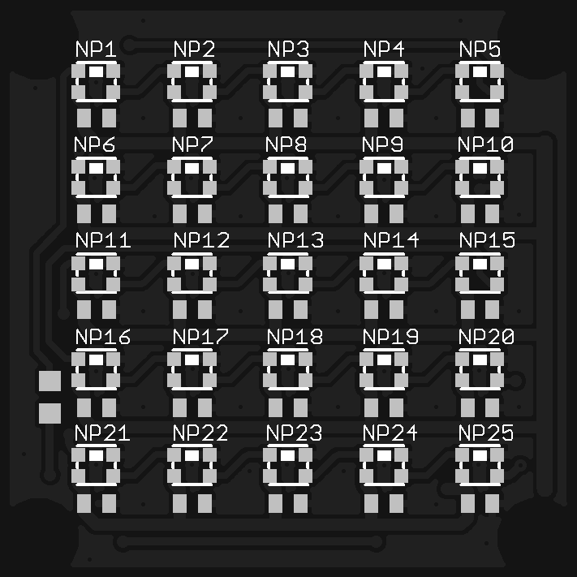
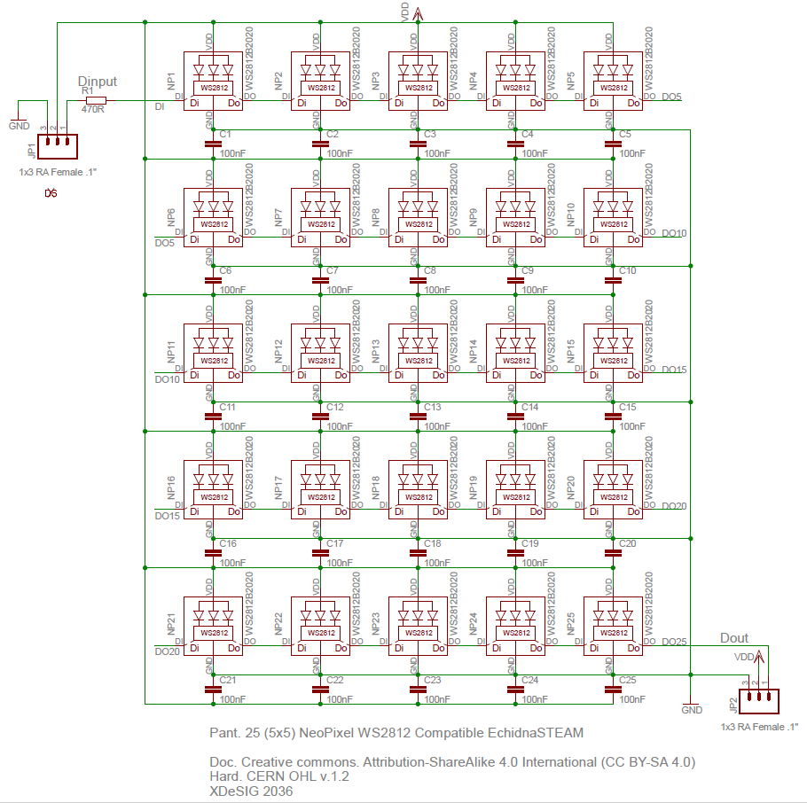

# Pantalla 25 (5x5) Neopixel 2020

## Aplicación
Con EchidnaBlack

## Serigrafía

## Esquema

Os capacitores son opcionais

## Licencia
Doc. Creative commons. Attribution-ShareAlike 4.0 International (CC BY-SA 4.0) Hard. CERN OHL v.1.2XDeSIG 2036
